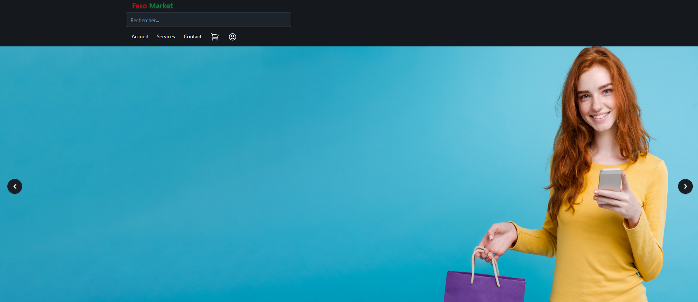
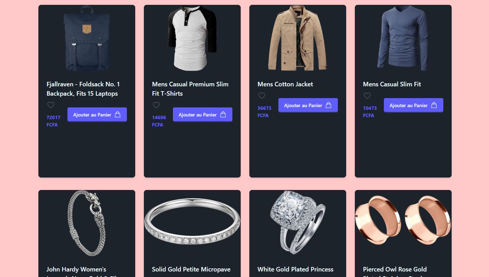

## Faso Market

An E-commerce app to illustrate all react concepts learnt

## Overview





## Features

features 1: 
features 2:
features 3:

## Tree

```
learn-react-js-Faso-market
├─ eslint.config.js
├─ header.png
├─ index.html
├─ maincontent.png
├─ package-lock.json
├─ package.json
├─ productdetail.png
├─ public
├─ README.md
├─ src
│  ├─ App.css
│  ├─ App.jsx
│  ├─ assets
│  │  ├─ bg1.jpg
│  │  ├─ bg2.jpg
│  │  ├─ bg3.jpg
│  │  └─ bg4.jpg
│  ├─ components
│  │  ├─ Carrousel.jsx
│  │  ├─ Footer.jsx
│  │  ├─ Header.jsx
│  │  ├─ Like.jsx
│  │  ├─ MainContent.jsx
│  │  ├─ MainOutlet.jsx
│  │  └─ Product
│  │     ├─ Product.jsx
│  │     ├─ ProductDetail.jsx
│  │     └─ ProductList.jsx
│  ├─ index.css
│  ├─ Layouts
│  │  └─ MainLayout.jsx
│  ├─ main.jsx
│  └─ route.jsx
└─ vite.config.js

```


## Dev

- Clone the repo

```bash
    git clone https://github.com/juanprince30/learn-react-js-Faso-market.git
```

- Install dependancies

```bash
npm install
```

- Start dev server

```bash
npm run dev
```
